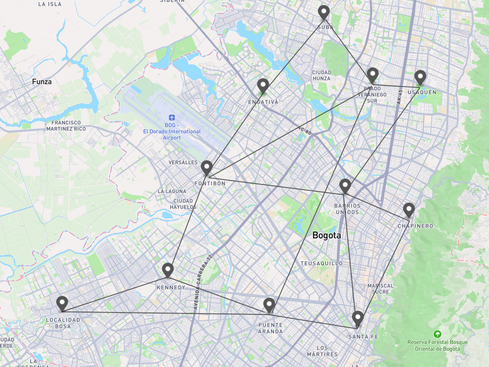
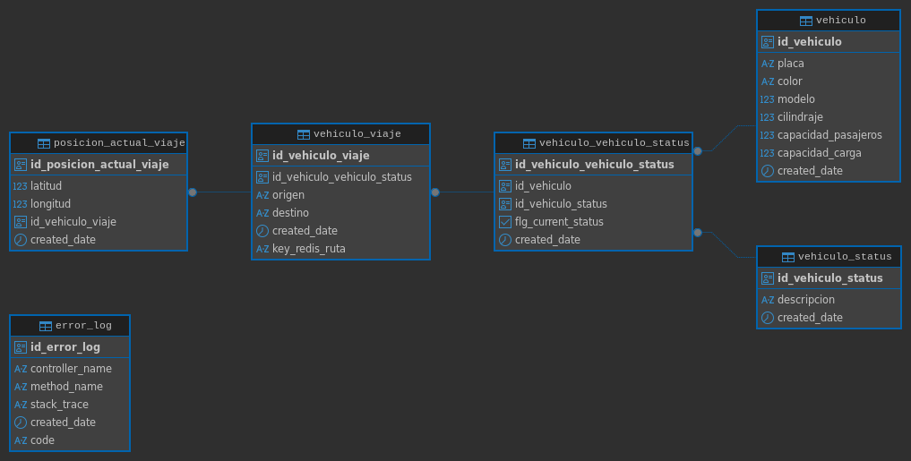
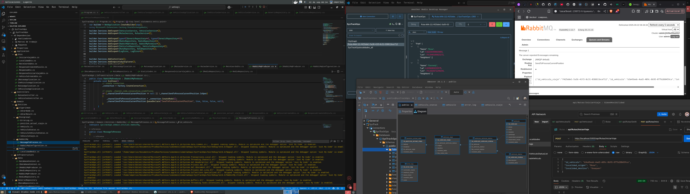

# Contexto



Para este ejercicio se planteó el siguiente grafo mock, el cual tiene 11 nodos correspondientes a 11 localidades. Estas localidades se asociaron mediante las rutas visibles en la gráfica. Este modelo mock se implementó en Redis utilizando RedisGraph; cada una de las aristas del grafo es bidireccional y la distancia (peso para la heurística de la implementación de A*) se calcula a partir de la latitud y longitud de los puntos. Se utilizó la herramienta https://geojson.io/
 para modelar los datos y obtener coordenadas reales.

El ejercicio contempla uno o varios vehículos (dependiendo de los que se parametricen en el sistema o se agreguen mediante el endpoint). Cada vehículo podrá definir un punto de origen y un punto de destino. La implementación calcula la ruta óptima usando el algoritmo A* (teniendo en cuenta que no se usan calles, sino la línea que une los puntos). Esta ruta óptima se almacena en caché en Redis y se guarda de manera transaccional en PostgreSQL.

Una vez que el vehículo seleccione la ruta, se habilitará un endpoint que recibe coordenadas; cada una de estas coordenadas se almacenará tanto en PostgreSQL como en Redis. Este proceso de almacenamiento se realiza mediante RabbitMQ para garantizar que, si alguna de las dos bases de datos no responde, el mensaje quede guardado en RabbitMQ hasta que se complete el almacenamiento en ambas partes.

Asimismo, se manejan tres posibles estados para un vehículo:

DISPONIBLE: Estado inicial al crear el vehículo; puede iniciar viajes.

EN CURSO: Estado mientras el vehículo está recorriendo la ruta y enviando coordenadas.

DISPONIBLE DE NUEVO: Estado al finalizar el viaje (cuando el vehículo envía una posición a aproximadamente 50 metros del destino).

NO DISPONIBLE: Estado parametrizado pero no utilizado en la implementación actual.

Finalmente, para el manejo de auditoría, se registran y controlan los errores generados dentro de la aplicación.

# comandos de despliegue

El despliegue se realizó utilizando Docker Compose. Cada uno de los servicios quedó configurado con scripts de inicialización para garantizar que los datos necesarios para la primera ejecución se almacenen correctamente tanto dentro de cada contenedor como en el almacenamiento del host.

```
git clone [repo]
cd SysTrackGps
docker compose up -d
```

# Strings de conexion

```
"ConnectionStrings": {
    "PostgresqlConnection": "Host=localhost;Port=5432;Database=SysTrackGps;Username=admin_prueba_tecnica;Password=l4tQmS5pv89IggWQTfJ",
    "Redis": "localhost:6379,user=default,password=C3JbTQR3zB82zogUKN"
},
"RabbitMq": {
    "UserName": "admin",
    "Password": "adminPassw0rd",
    "VirtualHost": "/",
    "HostName": "",
    "Port": "5672",
    "Url": "amqps://localhost:5672",
    "QueueName": "",
    "ExchangeName": "SysTrackGps.Exchange"
}
```

# Base de datos

## Postgresql



- `public.error_log`: tabla de auditoría de errores controlados.
- `public.vehiculo` : tabla de almacenamiento de la metadata de los vehículos.
- `public.vehiculo_status` : tabla de datos maestros con los posibles estados de los vehículos.
- `public.vehiculo_vehiculo_status` : tabla de asociación entre vehículos y estados.
- `public.vehiculo_viaje` : tabla de almacenamiento de viajes o rutas; aquí se guarda el origen, el destino y la clave de consulta para Redis.
- `public.posicion_actual_viaje` : tabla de almacenamiento de las coordenadas actuales de los vehículos durante el viaje.

## Redis grafo

```

/* ================================================
   Creación de Localidades con coordenadas
   ================================================ */

GRAPH.QUERY CityGraph "
CREATE
(:Localidad {name:'Usaquen', lat:4.716184571820477, lon:-74.04424425163468}),
(:Localidad {name:'Prado veraniego sur', lat:4.717335593755351, lon:-74.06434009036245}),
(:Localidad {name:'Suba', lat:4.743578375261492, lon:-74.08489790239479}),
(:Localidad {name:'Chapinero', lat:4.660703061232553, lon:-74.04909497132734}),
(:Localidad {name:'Barrios unidos', lat:4.670832794026751, lon:-74.07588942296492}),
(:Localidad {name:'Engativa', lat:4.712731494570704, lon:-74.11030643412036}),
(:Localidad {name:'Fontibon', lat:4.678429997618849, lon:-74.13386707262875}),
(:Localidad {name:'Santafe', lat:4.615347699066604, lon:-74.0705767299677}),
(:Localidad {name:'Puente Aranda', lat:4.620873381039658, lon:-74.10776558094774}),
(:Localidad {name:'Kennedy', lat:4.635608322257497, lon:-74.15026712492444}),
(:Localidad {name:'Bosa', lat:4.621564088258694, lon:-74.19461656211718})
"

/* ================================================
   Creación de aristas bidireccionales
   ================================================

'Suba' -> ('Prado veraniego sur', 'Engativa')
'Engativa' -> ('Fontibon', 'Suba')
'Fontibon' -> ('Engativa', 'Kennedy', 'Prado veraniego sur', 'Barrios unidos')
'Kennedy' -> ('Fontibon', 'Puente Aranda', 'Bosa')
'Bosa' -> ('Kennedy', 'Puente Aranda')
'Puente Aranda' -> ('Bosa', 'Kennedy', 'Prado veraniego sur', 'Santafe')
'Santafe' -> ('Puente Aranda', 'Barrios unidos', 'Chapinero')
'Chapinero' -> ('Santafe', 'Barrios unidos')
'Barrios unidos' -> ('Chapinero', 'Santafe', 'Fontibon', 'Usaquen')
'Usaquen' -> ( 'Barrios unidos', 'Prado veraniego sur')
'Prado veraniego sur' -> ('Suba', 'Fontibon', 'Puente Aranda', 'Usaquen')   

*/

GRAPH.QUERY CityGraph "
MATCH
  (suba:Localidad {name:'Suba'}),
  (prado:Localidad {name:'Prado veraniego sur'}),
  (engativa:Localidad {name:'Engativa'}),
  (fontibon:Localidad {name:'Fontibon'}),
  (kennedy:Localidad {name:'Kennedy'}),
  (bosa:Localidad {name:'Bosa'}),
  (puente:Localidad {name:'Puente Aranda'}),
  (santafe:Localidad {name:'Santafe'}),
  (chapinero:Localidad {name:'Chapinero'}),
  (barrios:Localidad {name:'Barrios unidos'}),
  (usaquen:Localidad {name:'Usaquen'})
CREATE
  (suba)-[:CONNECTED]->(prado), (prado)-[:CONNECTED]->(suba),
  (suba)-[:CONNECTED]->(engativa), (engativa)-[:CONNECTED]->(suba),
  (engativa)-[:CONNECTED]->(fontibon), (fontibon)-[:CONNECTED]->(engativa),
  (fontibon)-[:CONNECTED]->(kennedy), (kennedy)-[:CONNECTED]->(fontibon),
  (fontibon)-[:CONNECTED]->(prado), (prado)-[:CONNECTED]->(fontibon),
  (fontibon)-[:CONNECTED]->(barrios), (barrios)-[:CONNECTED]->(fontibon),
  (kennedy)-[:CONNECTED]->(bosa), (bosa)-[:CONNECTED]->(kennedy),
  (kennedy)-[:CONNECTED]->(puente), (puente)-[:CONNECTED]->(kennedy),
  (bosa)-[:CONNECTED]->(puente), (puente)-[:CONNECTED]->(bosa),
  (puente)-[:CONNECTED]->(santafe), (santafe)-[:CONNECTED]->(puente),
  (puente)-[:CONNECTED]->(prado), (prado)-[:CONNECTED]->(puente),
  (santafe)-[:CONNECTED]->(chapinero), (chapinero)-[:CONNECTED]->(santafe),
  (santafe)-[:CONNECTED]->(barrios), (barrios)-[:CONNECTED]->(santafe),
  (chapinero)-[:CONNECTED]->(barrios), (barrios)-[:CONNECTED]->(chapinero),
  (barrios)-[:CONNECTED]->(usaquen), (usaquen)-[:CONNECTED]->(barrios),
  (usaquen)-[:CONNECTED]->(prado), (prado)-[:CONNECTED]->(usaquen)
"
```

# Endpoints

### api/Vehiculos/GetVehiculoStatusList

- lista los estados maestros que puede tener el vehiculo

```bash
curl --location 'http://localhost:8080/api/Vehiculos/GetVehiculoStatusList'
```

### api/Vehiculos/CreateVehiculo

- Creacion del vehiculo

```bash
curl --location 'http://localhost:8080/api/Vehiculos/CreateVehiculo' \
--header 'Content-Type: application/json' \
--data '{
  "placa": "AAA-111",
  "color": "negro",
  "modelo": 1994,
  "cilindraje": 3.960,
  "capacidad_pasajeros": 5,
  "capacidad_carga": 2500
}'
```

### api/Rutas/GetAllLocalidades

- Lista las localidades almacenadas en el grafo de redis

```bash
curl --location 'http://localhost:8080/api/Rutas/GetAllLocalidades'
```

### api/Rutas/IniciarViaje

- Cambia de estado el vehiculo, calcula ruta optima de localidad origen a localidad destino, habilita el endpoint para recibir la informacion de las coordenadas actuales del vehiculo


```bash
curl --location 'http://localhost:8080/api/Rutas/IniciarViaje' \
--header 'Content-Type: application/json' \
--data '{
  "id_vehiculo": "70275af4-62c9-4e45-b543-2f2e5e6855c2",
  "localidad_origen": "Bosa",
  "localidad_destino": "Usaquen"
}'
```


### api/Rutas/RecvCoordsCurrentPosition

- Recibe el id del carro y las posiciones actuales, realiza persitencia en postgresql y redis por medio de docker


```bash
curl --location 'http://localhost:8080/api/Rutas/RecvCoordsCurrentPosition' \
--header 'Content-Type: application/json' \
--data '{
  "id_vehiculo": "70275af4-62c9-4e45-b543-2f2e5e6855c2",
  
  "latitud": 4.71618457182048,
  "longitud": -74.0442442516347
}'
```

# Dificultades

- Primera vez usando redis
- Me falto realizar los mocks pruebas de pruebas unitarias, pero se realizaron pruebas de debug y manuales por medio de los endpoints y los request en curl.

# Evidencia fotografica



